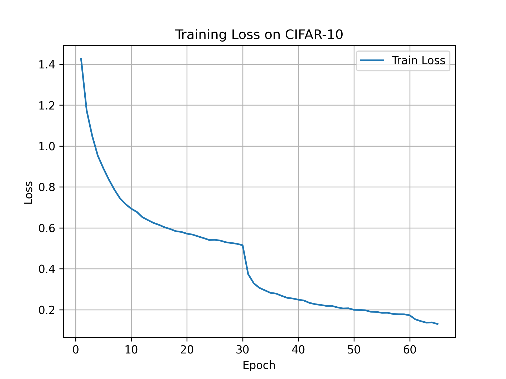
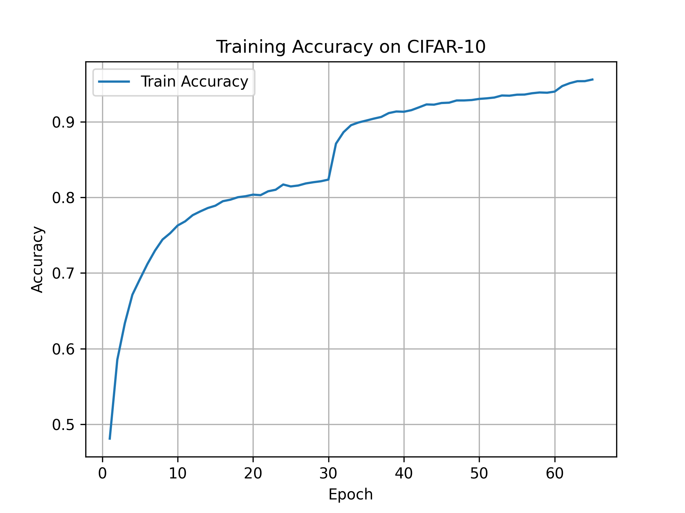

# Experiment Results

## Training Setup

- **Dataset:** CIFAR-10 (50k train / 10k test)
- **Input size:** 32×32 color images
- **Model:** Custom 5-layer CNN with BatchNorm, Dropout and LeakyReLU activations
- **Optimizer:** SGD (lr = 0.01, momentum = 0.9, weight decay = 5e-4)
- **Scheduler:** StepLR (step_size = 30, gamma = 0.1)
- **Batch size:** 32
- **Epochs (full training):** 150
- **Epochs (for plotting):** 65
- **Data augmentation:**
  - RandomHorizontalFlip
  - RandomRotation(20°)
  - RandomResizedCrop(32, scale = (0.7, 1.0))

## Training Curves

**Training loss:**

**Training accuracy:**

## Key Metrics (Training)

- Final **training accuracy**: ~96%  
- Final **training loss**: around 0.15–0.20

> Test/evaluation accuracy on the CIFAR-10 test set is **not added yet** (TODO).

